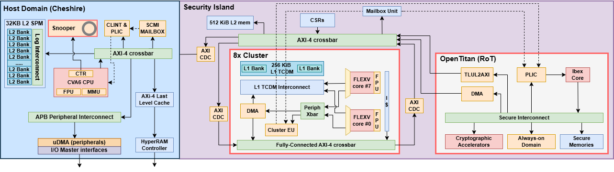
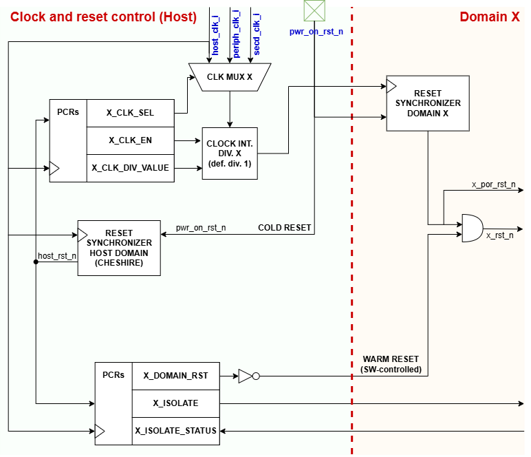
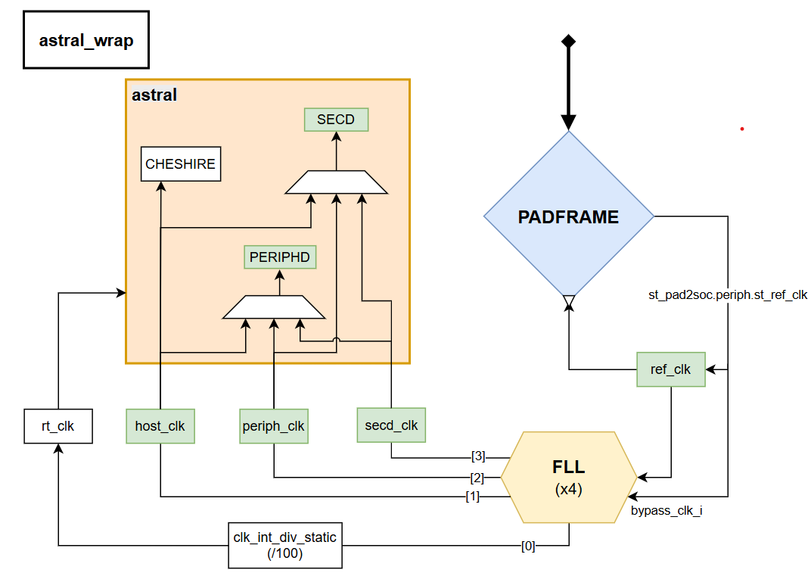

# Architecture

SCAR-V is organized in *domains*: *host domain*, *secure domain*, *peripheral domain*. It relies on Cheshire as its host domain, and extends its minimal SoC with additional
interconnect ports and interrupts.

The above block diagram depicts SCAR-V SoC architecture, which includes:

- **Domains**:
	- *Host domain* (Cheshire), a Linux-capable RV64 system based on dual-core CVA6 processors with
	  self-invalidation coherency mechanism
	- *Secure domain*, which comprises 2 main units:
        - a RV32-based Hardware Root of Trust (HW RoT) system that ensures the secure boot
          for the whole platform, serves as secure monitor for the entire
          system, and provides crypto acceleration services through various crypto-accelerators.
        - a programmable multi-core accelerator (PMCA), which is an 8-cores
          cluster with floating point processing capabilities (FPU) to accelerate intensive control tasks and with Hybrid Modular Redundancy (HMR) capabilities oriented to compute intensive integer workloads such as AI.

- **On-chip and off-chip memory endpoints**:
	- *Partitionable hybrid LLC SPM*: the last-level cache (*host domain*) can be configured as SPM
	  at runtime, as described in Cheshire's
	  [Architecture](https://fondazionechipsit.github.io/cheshire/um/arch/)
	- *External DRAM*: off-chip HyperRAM (Infineon) interfaced with in-house, open-source AXI4
	  Hyberbus memory controller and digital PHY connected to Cheshire's LLC

- **Mailbox unit**
	- Main communication vehicle among domains, based on an interrupt notification mechanism

- **Platform Control Registers (PCRs)**
	- Management and control registers for the entire platform, control clock sources assignments,
	  clock gating, isolation.

- **Interconnect** (as in Cheshire):
	- A last level cache (LLC) configurable as a scratchpad memory (SPM) per-way
	- Up to 16 external AXI4 manager ports and 16 AXI and Regbus subordinate ports
	- Per-manager AXI4 traffic regulators for real-time applications
	- Per-manager AXI4 bus error units (UNBENT) for interconnect error handling

- **Interrupts** (as in Cheshire):
	- Core-local (CLINT *and* CLIC) and platform (PLIC) interrupt controllers
	- Dynamic interrupt routing from and to internal and external targets.

- **Peripherals**:
	- Generic timers
	- PWM timers

## Memory Map

This section shows SCAR-V's memory map. The group `Internal to Cheshire` in the table below only
recalls the memory map described in the dedicatd [documentation for
Cheshire](https://fondazionechipsit.github.io/cheshire/um/arch/) and is explicitely shown here for
clarity.

| **Start Address**        | **End Address (excl.)** | **Length**       | **Size** | **Permissions** | **Cacheable** | **Atomics** | **Region**   | **Device**                                                           |
|--------------------------|-------------------------|------------------|----------|-----------------|---------------|-------------|--------------|----------------------------------------------------------------------|
| **Internal to Cheshire** |                         |                  |          |                 |               |             |              |                                                                      |
| `0x0000_0000`            | `0x0004_0000`           | `0x04_0000`      | 256 KiB  | (debug)         |               |             | Debug        | Debug CVA6                                                           |
| `0x0004_0000`            | `0x0100_0000`           |                  |          |                 |               |             | *Reserved*   |                                                                      |
| `0x0100_0000`            | `0x0100_1000`           | `0x00_1000`      | 4 KiB    | rw              |               |             | Config       | AXI DMA Config                                                       |
| `0x0100_1000`            | `0x0200_0000`           |                  |          |                 |               |             | *Reserved*   |                                                                      |
| `0x0200_0000`            | `0x0204_0000`           | `0x04_0000`      | 256 KiB  | rx              |               |             | Memory       | Boot ROM                                                             |
| `0x0204_0000`            | `0x0208_0000`           | `0x04_0000`      | 256 KiB  | rw              |               |             | Irq          | CLINT                                                                |
| `0x0208_0000`            | `0x020c_0000`           | `0x04_0000`      | 256 KiB  | rw              |               |             | Irq          | IRQ Routing                                                          |
| `0x020c_0000`            | `0x0210_0000`           | `0x04_0000`      | 256 KiB  | rw              |               |             | Irq          | AXI-REALM unit                                                       |
| `0x020c_0000`            | `0x0300_0000`           |                  |          |                 |               |             | *Reserved*   |                                                                      |
| `0x0300_0000`            | `0x0300_1000`           | `0x00_1000`      | 4 KiB    | rw              |               |             | Config       | Cheshire PCRs                                                        |
| `0x0300_1000`            | `0x0300_2000`           | `0x00_1000`      | 4 KiB    | rw              |               |             | Config       | LLC                                                                  |
| `0x0300_2000`            | `0x0300_3000`           | `0x00_1000`      | 4 KiB    | rw              |               |             | I/O          | [UART](https://opentitan.org/book/hw/ip/uart/doc/registers.html)     |
| `0x0300_4000`            | `0x0300_5000`           | `0x00_1000`      | 4 KiB    | rw              |               |             | I/O          | [SPIM](https://opentitan.org/book/hw/ip/spi_host/doc/registers.html) |
| `0x0300_5000`            | `0x0300_6000`           | `0x00_1000`      | 4 KiB    | rw              |               |             | I/O          | [GPIO](https://opentitan.org/book/hw/ip/gpio/doc/registers.html)     |
| `0x0300_8000`            | `0x0400_0000`           |                  |          |                 |               |             | *Reserved*   |                                                                      |
| `0x0400_0000`            | `0x1000_0000`           | `0x40_0000`      | 64 MiB   | rw              |               |             | Irq          | PLIC                                                                 |
| `0x0800_0000`            | `0x0C00_0000`           | `0x40_0000`      | 64 MiB   | rw              |               |             | Irq          | CLICs                                                                |
| `0x1000_0000`            | `0x1400_0000`           | `0x40_0000`      | 64 MiB   | rwx             | yes           | yes         | Memory       | LLC Scratchpad                                                       |
| `0x1400_0000`            | `0x1800_0000`           | `0x40_0000`      | 64 MiB   | rwx             |               | yes         | Memory       | LLC Scratchpad                                                       |
| `0x1800_0000`            | `0x2000_0000`           |                  |          |                 |               |             | *Reserved*   |                                                                      |
| **External to Cheshire** |                         |                  |          | rw              |               |             |              |                                                                      |
| `0x2000_4000`            | `0x2000_5000`           | `0x00_1000`      | 4 KiB    | rw              |               |             | I/O          | GP timer 1 (System timer)                                            |
| `0x2000_5000`            | `0x2000_6000`           | `0x00_1000`      | 4 KiB    | rw              |               |             | I/O          | GP timer 2 (Advanced timer)                                          |
| `0x2000_6000`            | `0x2000_7000`           | `0x00_1000`      | 4 KiB    | rw              |               |             | I/O          | GP timer 3                                                           |
| `0x2100_0000`            | `0x2100_1000`           | `0x00_1000`      | 4 KiB    | rw              |               |             | I/O          | Pad Config                                                           |
| `0x2100_2000`            | `0x2100_3000`           | `0x00_1000`      | 4 KiB    | rw              |               |             | I/O          | SCAR-V Control and Status                                            |
| `0x2100_3000`            | `0x2100_4000`           | `0x00_1000`      | 4 KiB    | rw              |               |             | I/O          | (if any) PLL/CLOCK                                                   |
| `0x2100_4000`            | `0x2100_5000`           | `0x00_1000`      | 4 KiB    | rw              |               |             | I/O          | HyperBus Cfg                                                         |
| `0x2800_1000`            | `0x4000_0000`           |                  |          |                 |               |             | *Reserved*   |                                                                      |
| `0x4000_0000`            | `0x4000_3000`           | `0x00_3000`      | 12 KiB   | rw              |               |             | Irq          | Mailboxes                                                            |

## Interrupt map

SCAR-V's interrupt components are exhaustively described in the dedicated section of the [documentation for
Cheshire](https://fondazionechipsit.github.io/cheshire/um/arch/). This section describes SCAR-V's interrupt map.

| **Interrupt Source**        | **Interrupt Sink**   | **Bitwidth** | **Connection**            | **Type**        | **Comment**          |
|-----------------------------|----------------------|--------------|---------------------------|-----------------|----------------------|
| **SCAR-V peripherals**      |                      |              |                           |                 |                      |
| `ch_0_o[0]                ` |                      | 1            | `car_adv_timer_intrs[0] ` | edge-sensitive  |                      |
| `ch_0_o[1]                ` |                      | 1            | `car_adv_timer_intrs[1] ` | edge-sensitive  |                      |
| `ch_0_o[2]                ` |                      | 1            | `car_adv_timer_intrs[2] ` | edge-sensitive  |                      |
| `ch_0_o[3]                ` |                      | 1            | `car_adv_timer_intrs[3] ` | edge-sensitive  |                      |
| `events_o[0]              ` |                      | 1            | `car_adv_timer_events[0]` | edge-sensitive  |                      |
| `events_o[1]              ` |                      | 1            | `car_adv_timer_events[1]` | edge-sensitive  |                      |
| `events_o[2]              ` |                      | 1            | `car_adv_timer_events[2]` | edge-sensitive  |                      |
| `events_o[3]              ` |                      | 1            | `car_adv_timer_events[3]` | edge-sensitive  |                      |
| `irq_lo_o                 ` |                      | 1            | `car_sys_timer_lo_intr  ` | edge-sensitive  |                      |
| `irq_hi_o                 ` |                      | 1            | `car_sys_timer_hi_intr  ` | edge-sensitive  |                      |
| **Cheshire peripherals**    |                      |              |                           |                 |                      |
| `zero                `      |                      | 1            | `zero                `    | level-sensitive |                      |
| `uart                `      |                      | 1            | `uart                `    | level-sensitive |                      |
| `spih_error          `      |                      | 1            | `spih_error          `    | level-sensitive |                      |
| `spih_spi_event      `      |                      | 1            | `spih_spi_event      `    | level-sensitive |                      |
| `gpio                `      |                      | 32           | `gpio                `    | level-sensitive |                      |
| **Secure Domain**           |                      |              |                           |                 |                      |
|                             | `irq_ibex_i`         | 1            | `secd_mbox_intr       `   | level-sensitive | to wake-up Ibex core |
|                             | `cfi_req_irq_i`      | 1            | `chs_intrs_distributed`   | level-sensitive | from CVA6 CFI Snooper|
|                             | `cfi_watermark_irq_i`| 1            | `chs_intrs_distributed`   | level-sensitive | from CVA6 CFI Snooper|
| **Host Domain (Cheshire)**  |                      |              |                           |                 |                      |
|                             | `intr_ext_i[6:0]  `  | 7            | `0                      ` |                 | tied to 0            |
|                             | `intr_ext_i[8:7]  `  | 2            | `secd_hostd_mbox_intr   ` | level-sensitive | from secure domain   |
|                             | `intr_ext_i[14:9]  ` | 6            | `0                      ` |                 | tied to 0            |
|                             | `intr_ext_i[15]   `  | 1            | `car_adv_timer_intrs[0] ` | edge-sensitive  | from peripherals     |
|                             | `intr_ext_i[16]   `  | 1            | `car_adv_timer_intrs[1] ` | edge-sensitive  | from peripherals     |
|                             | `intr_ext_i[17]   `  | 1            | `car_adv_timer_intrs[2] ` | edge-sensitive  | from peripherals     |
|                             | `intr_ext_i[18]   `  | 1            | `car_adv_timer_intrs[3] ` | edge-sensitive  | from peripherals     |
|                             | `intr_ext_i[19]   `  | 1            | `car_adv_timer_events[0]` | edge-sensitive  | from peripherals     |
|                             | `intr_ext_i[20]   `  | 1            | `car_adv_timer_events[1]` | edge-sensitive  | from peripherals     |
|                             | `intr_ext_i[21]   `  | 1            | `car_adv_timer_events[2]` | edge-sensitive  | from peripherals     |
|                             | `intr_ext_i[22]   `  | 1            | `car_adv_timer_events[3]` | edge-sensitive  | from peripherals     |
|                             | `intr_ext_i[23]   `  | 1            | `car_sys_timer_lo_intr  ` | edge-sensitive  | from peripherals     |
|                             | `intr_ext_i[24]   `  | 1            | `car_sys_timer_hi_intr  ` | edge-sensitive  | from peripherals     |
|                             | `intr_ext_i[31:25]`  | 7            | `0                      ` |                 | tied to 0            |
| `meip_ext_o[0]`             |                      | \-           |                           | level-sensitive | unconnected          |
| `meip_ext_o[1]`             |                      | \-           |                           | level-sensitive | unconnected          |
| `meip_ext_o[2]`             |                      | \-           |                           | level-sensitive | unconnected          |
| `seip_ext_o[0]`             |                      | \-           |                           | level-sensitive | unconnected          |
| `seip_ext_o[1]`             |                      | \-           |                           | level-sensitive | unconnected          |
| `seip_ext_o[2]`             |                      | \-           |                           | level-sensitive | unconnected          |
| `msip_ext_o[0]`             |                      | \-           |                           | level-sensitive | unconnected          |
| `msip_ext_o[1]`             |                      | \-           |                           | level-sensitive | unconnected          |
| `msip_ext_o[2]`             |                      | \-           |                           | level-sensitive | unconnected          |
| `mtip_ext_o[0]`             |                      | \-           |                           | level-sensitive | unconnected          |
| `mtip_ext_o[1]`             |                      | \-           |                           | level-sensitive | unconnected          |
| `mtip_ext_o[2]`             |                      | \-           |                           | level-sensitive | unconnected          |

## Domains

The total number of domains is 3: *host domain*, *secure domain*, *peripheral domain*.

SCAR-V's domains live in dedicated repositories. We therefore invite the reader to consult the
documentation of each domain.

For more information about domains' memory requirements, visit [Synthesis and physical
implementation](../tg/synth.md).

Below, we focus on domains' parameterization within SCAR-V.

### [Host domain (Cheshire)](https://github.com/FondazioneChipsIT/cheshire)

**(CHECK parts on safe domain)**

The *host domain* (Cheshire) embeds all the necessary components required to run OSs such as
embedded Linux. It has two orthogonal *operation modes*.

1. *Untrusted mode*: in this operation mode, the host domain is tasked to run untrusted services,
i.e. non time- and non safety-critical applications. For example, this could be the case of infotainment
on a modern car. In this mode, as in traditional automotive platforms, safety and resiliency
features are deferred to a dedicated 32-bit microcontroller-like system, called `safe domain` in
SCAR-V.

2. *Hybrid trusted/untrusted mode*: in this operation mode, the host domain is in charge of both
critical and non-critical applications. Key features supported to achieve this are:
  * A virtualization layer, which allows the system to accommodate the execution of multiple OSs,
including rich, Unix-like OSs and Real-Time OSs (RTOS), coexisting on the same HW.
  * Spatial and temporal partitioning of resources: AXI matrix crossbar
	([AXI-REALM](https://arxiv.org/abs/2311.09662)), LLC, TLB, and a `physical tagger` in front of
	the cores to mark partitions by acting directly on the physical address space
  * Runtime configurable data/instruction cache and SPM
  * Fast interrupt handling, with optional interrupt routing through the RISC-V fast interrupt
controller CLIC,
  * Configurable dual core setup between *lockstep* or *SMP* mode.

  Hybrid operation mode is currently experimental, and mostly for research purposes. We advise of
  relying on a combination of host ad safe domain for a more traditional approach.

Cheshire is configured as follows:

* One 64-bit, RISC-V CVA6S+ superscalar core with Control Flow Integrity extensions (landing pad, shadow stack)
* 2 external AXI manager ports (`AxiNumExtSlv`) added to the matrix crossbar:
  - Mailbox unit
  - Peripherals
* 1 external AXI subordinate ports (`AxiNumExtMst`) added to the matrix crossbar:
  - Secure domain
* 4 external regbus subordinate ports (`NumTotalRegSlv`):
  - PCRs: control domains enable, clock gate, isolation
  - FLL control registers: for ASIC top-levels, leave unconnected otherwise
  - Padmux control registers: for ASIC top-levels, leave unconnected otherwise
  - Hyperbus configuration: programming interface of the hyperbus controller
* Last-level cache (LLC) with HW spatial partitioning
* 32 *external* input interrupts (`CarfieldNumExtIntrs`), see [Interrupt map](#interrupt-map) in
  addition to Cheshire's own internal interrupts. Unused are tied to 0 (currently 20/32)
* An interrupt router with 1 external target (`CarfieldNUmRouterTargets`), tasked to distribute N
  input interrupts to M targets. In SCAR-V, the external target is the `secure domain`.
* These Cheshire peripherals: JTAG, SPI, UART, GPIO

By default, Cheshire hosts 128 KiB of hybrid LLC/SPM, user-configurable.

### [Secure domain](https://github.com/FondazioneChipsIT/security_island)

The secure domain, based on the [OpenTitan project](https://opentitan.org/book/doc/introduction.html), serves as the Hardware Root-of-Trust
(HWRoT) of the platform. It handles *secure boot* and system integrity monitoring fully in HW
through cryptographic acceleration services.

Compared to OpenTitan (Top Earlgrey), this RoT is modified/configured as follows:

* 1 AXI4 manager interface to SCAR-V, with a bridge between AXI4 and TileLink Uncached Lightweight
  (TL-UL) internally used by OpenTitan. By only exposing a manager port, unwanted access to the
  secure domain is prevented.

* Embedded flash memory replaced with an SRAM preloaded before secure boot procedure from an
  external SPI flash through OpenTitan private SPI peripheral. Once preload is over, the OpenTitan
  secure boot framework is unchanged compared to the vanilla version.

* a *boot manager* module has been designed and integrated to manage the [two available
  bootmodes](./sw.md). In **Secure** mode, the system executes the secure boot framework as soon as
  the reset is asserted, loading code from the external SPI and performing the signature check on
  its content. Otherwise, in **Non-secure** mode, the *secure domain* is clock gated and must be
  clocked and woken-up by an external entity (e.g., *host domain*)

By default, the secure domain hosts 512 KiB of main SPM, and 16 KiB of OTP memory, user-configurable.

#### [Programmable Multi-Core Accelerator (PMCA)](https://github.com/FondazioneChipsIT/pulp_cluster/tree/yt/scarv-release)

To augment computational capabilities, the secure domain incorporates one PMCA, described below. This PMCA
integrates a DMA engine to independently fetch data from the on-chip SPM or external DRAM.

The PMCA is specialized in accelerating the inference of Deep Learning and Machine Learning models. The
multicore accelerator is built around 12 32-bit RISC-V cores empowered with ISA extensions, enabling
integer arithmetic from 32-bit down to 2-bit precision.

The PMCA features a [Hybrid Modular Redundancy (HMR)](https://doi.org/10.1145/3635161) extension, so that it can
be configured in multiple redundant modes:

* **Independent:** All cores act independently with no redundancy mechanism. This configuration allows
  higher performance but has no reliability.

* **Dual Modular Redundancy (DMR)**: The cores are grouped in lock-stepped pairs and rely on a
  specialized hardware extension for fast fault recovery in less than 30 clock cycles in case of
  fault detection. The PMCA provides the best trade-off between performance and fault recovery in
  this configuration. In this configuration the grouped cores also execute code with 2 cycles delay
  distance to prevent simultaneous fault/attack propagation among grouped cores.

The PMCA integrates an FPU co-processor for each core to support multi-format floating-point operations.

Including the [Safe-NEureka](https://arxiv.org/abs/2602.04803) neural engine, the PMCA's general-purpose
cores can be reconfigured for *redundant execution*. A  unit allows the
split/lock of the available cores in different redundant configurations during runtime, trading off
the computing performance and the fault resilience capability according to the criticality of the
application.

By default, the PMCA's processing elements and tensor accelerator share access to 256 KiB of
L1 SPM (TCDM).

## On-chip and off-chip memory endpoints

### [Partitionable hybrid LLC/SPM](https://github.com/pulp-platform/axi_llc)

SCAR-V hosts a LLC optionaly reconfigurable as SPM during runtime. In addition, the LLC supports
HW-based partitioning to exploit intra-process or inter-processes isolation, improving the system's
predictability. The LLC is described in detail in Cheshire's
[Architecture](https://pulp-platform.github.io/cheshire/um/arch).

### [HyperBus off-chip link](https://github.com/FondazioneChipsIT/hyperbus)

SCAR-V integrates a in-house, open-source implementation of Infineon' HyperBus off-chip controller
to connect to external HyperRAM modules.

It manages the following features:

* An AXI interface that attaches to Cheshire's [partitionable hybrid LLC/SPM](#partitionable-hybrid-llc-spm)
* A configurable number of physical HyperRAM chips it can be attached to; by default, support for 2
  physical chips is provided
* Support for HyperRAM chips with different densities (from 8MiB to 64MiB per chip aligned with
  specs).

## System bus interconnect

The interconnect is composed of a main [AXI4](https://github.com/FondazioneChipsIT/axi) matrix (or
crossbar) with AXI5 atomic operations (ATOPs) support. The crossbar extends Cheshire's with
additional external AXI manager and subordinate ports.

Cheshire's auxiliary [Regbus](https://github.com/pulp-platform/register_interface) demultiplexer is
extended with additional peripheral configuration ports for external PLL/FLL and padmux
configuration, which are specific of ASIC wrappers.

An additional peripheral subsystem based on APB hosts SCAR-V-specific peripherals.

## [Mailbox unit](https://github.com/pulp-platform/mailbox_unit)

The mailbox unit consists in a number of configurable mailboxes. Each mailbox is the preferred
communication vehicle between *domains*. It can be used to wake-up certain domains, notify an
*offloader* (e.g., Cheshire) that a *target device* (e.g., the PMCA in the secure domain) has
reached execution completion, dispatch *entry points* to a *target device* to jump-start its
execution, and many others.

It manages the following features:

* Interrupt based signaling receiver and sender
* A shared memory space common to all the mailboxes, implemented as a single register file.
  Currently, SCAR-V implements 10 mailboxes.
* Support for 32-bit word aligned read/write access.
* A convenience AXI-Lite wrapper for the configuration port.

---

Assuming each mailbox is identified with id `i`, the register file map reads:

| **Offset**         | **Register**     | **Width (bit)** | **Note**           |
|--------------------|------------------|-----------------|--------------------|
| `0x00 + i * 0x100` | `INT_SND_STAT`   | `1`             | current irq status |
| `0x04 + i * 0x100` | `INT_SND_SET `   | `1`             | set irq            |
| `0x08 + i * 0x100` | `INT_SND_CLR `   | `1`             | clear irq          |
| `0x0C + i * 0x100` | `INT_SND_EN  `   | `1`             | enable irq         |
| `0x40 + i * 0x100` | `INT_RCV_STAT`   | `1`             | current irq status |
| `0x44 + i * 0x100` | `INT_RCV_SET `   | `1`             | set irq            |
| `0x48 + i * 0x100` | `INT_RCV_CLR `   | `1`             | clear irq          |
| `0x4C + i * 0x100` | `INT_RCV_EN  `   | `1`             | enable irq         |
| `0x80 + i * 0x100` | `LETTER0       ` | `32`            | message            |
| `0x8C + i * 0x100` | `LETTER1       ` | `32`            | message            |

The above register map can be found in the dedicated
[repository](https://github.com/pulp-platform/mailbox_unit) and is reported here for convenience.

## Platform Control Registers

PCRs provide basic system information, and control clock, reset and other functionalities of
SCAR-V's *domains*.

A more detailed overview of each PCR (register subfields and description) can be found
[here](../../hw/regs/pcr/). PCR base address is listed in the [Memory Map](#memory-map) as for the
other devices.

| **Name**                         | **Offset** | **Length** | **Description**                                                        |
|:---------------------------------|:-----------|-----------:|:-----------------------------------------------------------------------|
| `VERSION0`                       | `0x0`      |        `4` | Cheshire sha256 commit                                                 |
| `VERSION1`                       | `0x4`      |        `4` | Safety Island sha256 commit                                            |
| `VERSION2`                       | `0x8`      |        `4` | Security Island sha256 commit                                          |
| `VERSION3`                       | `0xc`      |        `4` | PULP Cluster sha256 commit                                             |
| `VERSION4`                       | `0x10`     |        `4` | Spatz CLuster sha256 commit                                            |
| `JEDEC_IDCODE`                   | `0x14`     |        `4` | JEDEC ID CODE                                                          |
| `HOST_RST`                       | `0x20`     |        `4` | Host Domain reset -active high, inverted in HW-                        |
| `PERIPH_RST`                     | `0x24`     |        `4` | Periph Domain reset -active high, inverted in HW-                      |
| `SECURITY_ISLAND_RST`            | `0x2c`     |        `4` | Security Island reset -active high, inverted in HW-                    |
| `PERIPH_ISOLATE`                 | `0x3c`     |        `4` | Periph Domain  AXI isolate                                             |
| `SECURITY_ISLAND_ISOLATE`        | `0x44`     |        `4` | Security Island AXI isolate                                            |
| `PERIPH_ISOLATE_STATUS`          | `0x54`     |        `4` | Periph Domain AXI isolate status                                       |
| `SECURITY_ISLAND_ISOLATE_STATUS` | `0x5c`     |        `4` | Security Island AXI isolate status                                     |
| `PERIPH_CLK_EN`                  | `0x6c`     |        `4` | Periph Domain clk gate enable                                          |
| `SECURITY_ISLAND_CLK_EN`         | `0x74`     |        `4` | Security Island clk gate enable                                        |
| `PERIPH_CLK_SEL`                 | `0x84`     |        `4` | Periph Domain fll select (0 -> host fll, 1 -> periph fll, 2 -> secd fll)  |
| `SECURITY_ISLAND_CLK_SEL`        | `0x8c`     |        `4` | Security Island fll select (0 -> host fll, 1 -> periph fll, 2 -> secd fll)|
| `PERIPH_CLK_DIV_VALUE`           | `0x9c`     |        `4` | Periph Domain clk divider value                                        |
| `SECURITY_ISLAND_CLK_DIV_VALUE`  | `0xa4`     |        `4` | Security Island clk divider value                                      |
| `HOST_FETCH_ENABLE`              | `0xb4`     |        `4` | Host Domain fetch enable                                               |
| `SECURITY_ISLAND_FETCH_ENABLE`   | `0xbc`     |        `4` | Security Island fetch enable                                           |
| `HOST_BOOT_ADDR`                 | `0xc8`     |        `4` | Host boot address                                                      |
| `SECURITY_ISLAND_BOOT_ADDR`      | `0xd0`     |        `4` | Security Island boot address                                           |

## Peripherals

SCAR-V enhances Cheshire's peripheral subsystem with additional capabilities.

An external AXI manager port is attached to the matrix crossbar. The 64-bit data, 48-bit address AXI
protocol is converted to the slower, 32-bit data and address APB protocol. An APB demultiplexer
allows attaching several peripherals, described below.

### Generic and advanced timer

SCAR-V integrates a generic timer and an advanced timer.

The [*generic timer*](https://github.com/pulp-platform/timer_unit) manages the following features:

- 2 general purpose 32-bit up counter timers
- Input trigger sources:
	 - FLL/PLL clock
	 - FLL/PLL clock + Prescaler
	 - Real-time clock (RTC) at crystal frequency (32kHz) or higher
	 - External event
- 8-bit programmable prescaler to FLL/PLL clock
- Counting modes:
	 - One shot mode: timer is stopped after first comparison match
	 - Continuous mode: timer continues counting after comparison match
	 - Cycle mode: timer resets to 0 after comparison match and continues counting
	 - 64 bit cascaded mode
- Interrupt request generation on comparison match

For more information, read the dedicated
[documentation](https://github.com/pulp-platform/timer_unit/blob/master/doc/TIMER_UNIT_reference.xlsx).

The [*advanced timer*](https://github.com/pulp-platform/apb_adv_timer) manages the following
features:

* 4 timers with 4 output signal channels each
* PWM generation functionality
* Multiple trigger input sources:
   - output signal channels of all timers
   - 32 GPIOs
   - Real-time clock (RTC) at crystal frequency (32kHz) or higher
   - FLL/PLL clock
  In SCAR-V, we rely on a RTC.
* Configurable input trigger modes
* Configurable prescaler for each timer
* Configurable counting mode for each timer
* Configurable channel threshold action for each timer
* 4 configurable output events
* Configurable clock gating of each timer

For more information, read the dedicated
[documentation](https://github.com/pulp-platform/apb_adv_timer/blob/master/doc/APB_ADV_TIMER_reference.xlsx).

## Clock and reset

The two figures above show the clock, reset and isolation distribution for a *domain* `X` in
SCAR-V, and their relationship. A more detailed description is provided below.

### Clock distribution scheme, clock gating and isolation

SCAR-V is provided with 3 clocks sources. They can be fully asynchronous and not bound to any
phase relationship, since dual-clock FIFOs are placed between domains to allow clock domain crossing
(CDC):

* `host_clk_i`: preferably, clock of the *host domain*
* `periph_clk_i`: preferably, clock of *peripheral domain*
* `secd_clk_i`: preferably, clock of the *secure domain*

In addition, a real-time clock (RTC, `rt_clk_i`) is provided externally, at crystal frequency
(32kHz) or higher.

These clocks are supplied externally, by a dedicated FLL per clock source or by a single FLL that
supplies all three clock sources. The configuration of the clock source can be handled by the
external FLL wrapper configuration registers, e.g. in a ASIC top level.

Regardless of the specific name used for the clock signals in HW, SCAR-V has a flexible clock
distribution that allows each of the 3 clock sources to be assigned to a *domain*, as explained
below.

---

*Secure domain* and *peripheral domain* can be clock gated and *isolated*.

When *isolation* for a domain `X` is enabled, data transfers towards a domain are terminated and
never reach it. To achieve this, an AXI4 compliant *isolation* module is placed in front of each
domain. The bottom figure shows in detail the architecture of the isolation scheme between the *host
domain* and a generic `X` domain, highlighting its relationship with the domain's reset and cloc
signals.

For each of these domains, the following clock distribution scheme applies:

1. The user selects one of the 3 different clock sources
2. The selected clock source for the domain is fed into a default-bypassed arbitrary integer clock
   divider with 50% duty cycle. This allows to use different integer clock divisions for every
   target domain to use different clock frequencies
3. The internal clock gate of the clock divider is used to provide clock gating for the domain.

HW resources for the clock distribution (steps 1., 2., and 3.) and isolation of a domain `X`, are
SW-controlled via dedicated PCRs. Refer to [Platform Control Registers](#platform-control-registers)
in this page for more information.

The only domain that is always-on and de-isolated is the *host domain* (Cheshire). If required,
clock gating and/or isolation of it can be handled at higher levels of hierarchy, e.g. in a
dedicated ASIC wrapper.

### Startup behavior after Power-on reset (POR)

The user can decide whether *secure boot* must be performed on the executing code before runtime. If
so, the *secure domain* must be active after POR, i.e., clocked and de-isolated. This behavior is
regulated by the input pin `secure_boot_i` according to the following table:

| `secure_boot_i` | **Secure Boot** | **System status after POR**                                                                                                                       |
|:----------------|----------------:|:--------------------------------------------------------------------------------------------------------------------------------------------------|
| `0`             |           `OFF` | *secure domain* gated and isolated as *peripheral domain*, *host domain* always-on and idle                                                       |
| `1`             |            `ON` | *host domain* always-on and idle, *secure domain* active, takes over *secure boot* and can't be warm reset-ed; *peripheral domain* gated and isolated |

Regardless of the value of `secure_boot_i`, since by default some domains are clock gated and
isolated after POR, SW or external physical interfaces (JTAG/Serial Link) must handle their wake-up
process. Routines are provided in the [Software Stack](../../sw/include/car_util/).

### Reset distribution scheme

SCAR-V is provided with one POR (active-low), `pwr_on_rst_ni`, responsible for the platform's
*cold reset*.

The POR is synchronized with the clock of each domain, user-selected as explained above, and
propagated to the domain.

In addition, a *warm reset* can be initiated from SW through the PCRs for each domain. Exceptions to
this are the *host domain* (always-on), and the *secure domain* when `secure_boot_i` is asserted.
